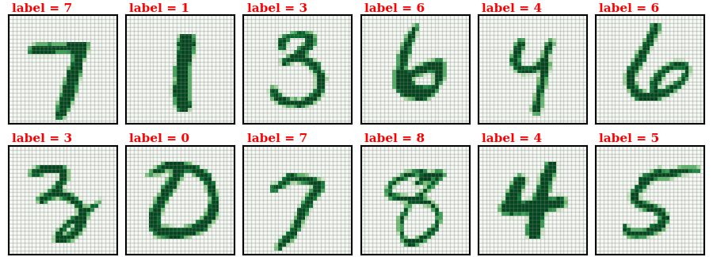

# Number Classification Neural Network

Below is the tale of my pioneering journey into the world of neural networks.
The goal of this project is to develop the code to create a deep learning neural network designed to classify images of hand-written digits.
Although there are some great existing libraries with "ready-made" code for this problem (e.g. [scikit-learn](https://scikit-learn.org/stable/modules/neural_networks_supervised.html), [tensorflow](https://www.tensorflow.org/tutorials/keras/basic_classification)) my aim is to write everything *mostly* from scratch.
I also hope to do a good enough job documenting the workflow to serve as a learning tool for any interested readers.

Before going on further I must acknowledge the superb educational/instructional video series from Grant Sanderson's YouTube channel [3Blue1Brown](https://www.youtube.com/watch?v=aircAruvnKk) which layed the foundation for this project.

## Data

Training and testing data are taken from the well-known and widely-utilized [MNIST database](http://yann.lecun.com/exdb/mnist/).
This database includes a training set of 60,000 labeled images and a test set of 10,000 labeled images; however, because there are no intrinsic differences between the two you can think of it as one aggregate set of 70,000 images.
Each image is 28x28 pixels in size and has been preprocessed to be centered in the field based on the "center of mass" of the pixel values (*I learned this the hard way by trying to center the images myself only to find that it had already been done*).

Here are a few examples of the images:

## The Neural Network

The code supports defining a network with an arbitrary number of hidden layers each containing an arbitrary number of neurons.
For testing purposes I decided to go with two hidden layers each containing 28 neruons.

