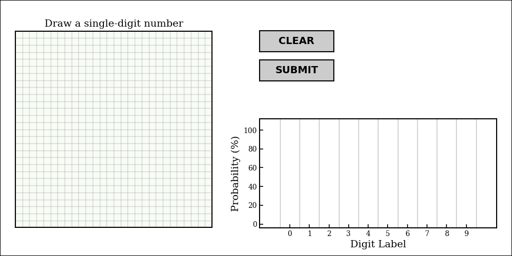

# Number Classification Neural Network

Below is the tale of my pioneering journey into the world of neural networks.
The goal of this project is to develop the code to create a deep learning neural network designed to classify images of hand-written digits.
Although there are some great existing libraries with "ready-made" code for this problem (e.g. [scikit-learn](https://scikit-learn.org/stable/modules/neural_networks_supervised.html), [tensorflow](https://www.tensorflow.org/tutorials/keras/basic_classification)) my aim is to write everything *mostly* from scratch.
I also hope to do a good enough job documenting the workflow to serve as a learning tool for any interested readers.

Before going on further I must acknowledge the superb educational/instructional video series from Grant Sanderson's YouTube channel [3Blue1Brown](https://www.youtube.com/watch?v=aircAruvnKk) which layed the foundation for this project.


### Outline

 * [About the Data](https://github.com/tomczak724/Number_Classification_Neural_Network/blob/master/README.md#about-the-data)
 * [About the Network](https://github.com/tomczak724/Number_Classification_Neural_Network/blob/master/README.md#about-the-network)
 * [Tutorial: Digit Canvas](https://github.com/tomczak724/Number_Classification_Neural_Network/blob/master/README.md#tutorial:-digit-canvas) - Draw your own numbers and have the network guess them


### About the Data
___

Training and testing data are taken from the well-known and widely-utilized [MNIST database](http://yann.lecun.com/exdb/mnist/).
This database includes a training set of 60,000 labeled images and a test set of 10,000 labeled images; however, because there are no intrinsic differences between the two you can think of it as one aggregate set of 70,000 images.
Each image is 28x28 pixels in size and has been preprocessed to be centered in the field based on the "center of mass" of the pixel values (*I learned this the hard way by trying to center the images myself only to find that it had already been done*).

Here are a few examples of the images:


### About the Network
___

The code supports defining a network with an arbitrary number of hidden layers each containing an arbitrary number of neurons.
For testing purposes I decided to go with two hidden layers each containing 28 neruons.


### Tutorial: Digit Canvas
___

Digit Canvas is an interactive figure which allows you to draw your own numerals and have the network guess them.

First you must clone the repository to your machine.
Next, open a terminal and switch to the `code` directory within it and execute the python script.

```
git clone https://github.com/tomczak724/Number_Classification_Neural_Network.git
cd Number_Classification_Neural_Network/code/
python DigitCanvas.py
```

If all went well a figure like this should appear:



Simply use your mouse to draw your number of choice in the large square panel on the left.


Once you're finished click the **SUBMIT** button to have your drawing digitized, centered, and processed by the network to guess your digit.

The panel to the lower-right will indicate the network's best guess as well as it's confidence in all 10 possible digits.
Click the **CLEAR** button to reset.


